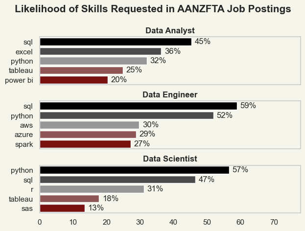
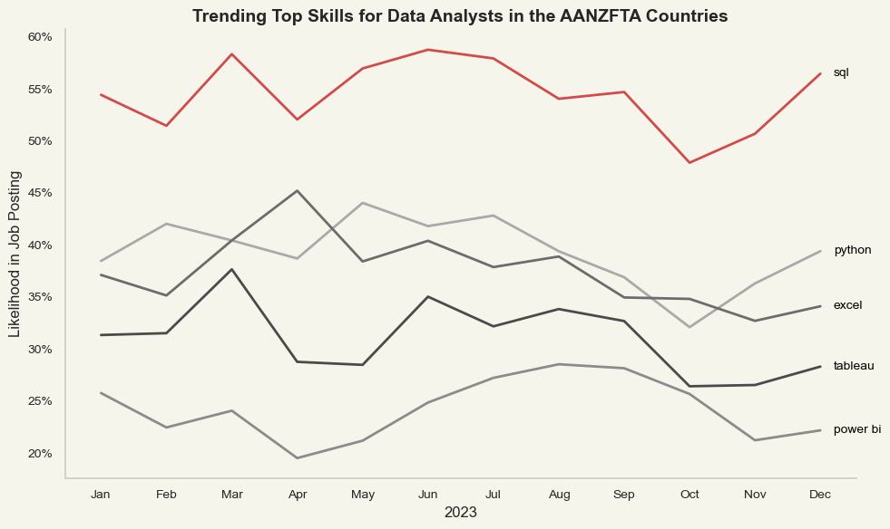
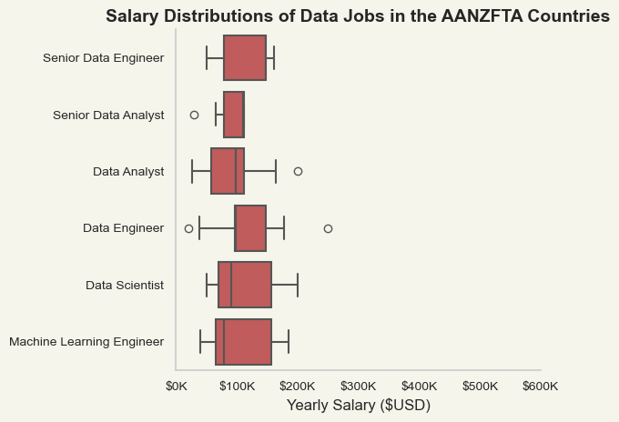
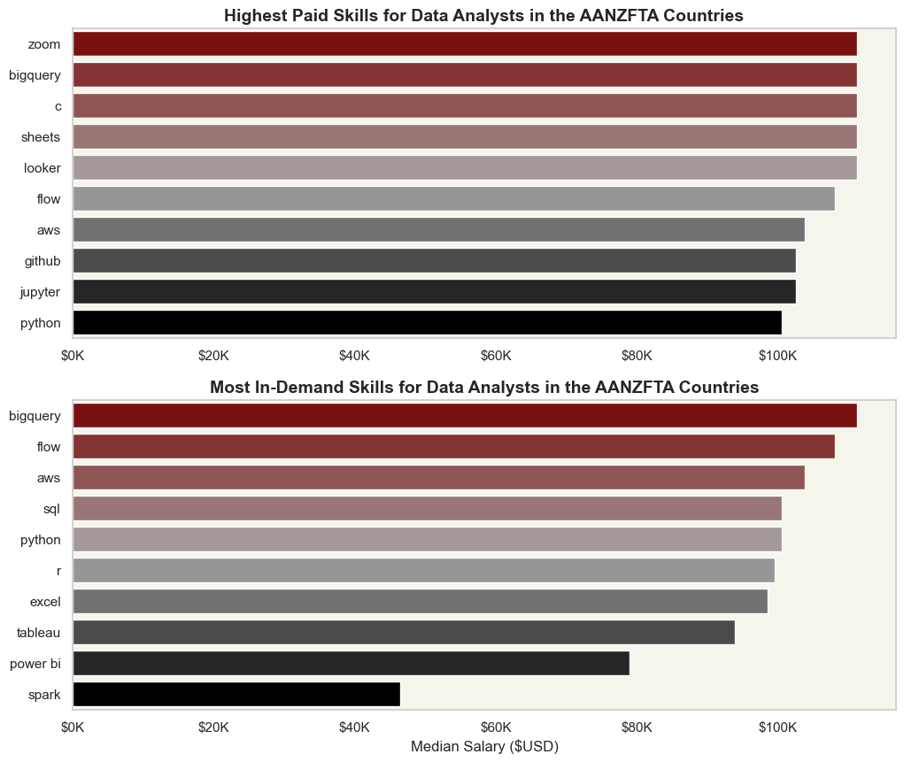
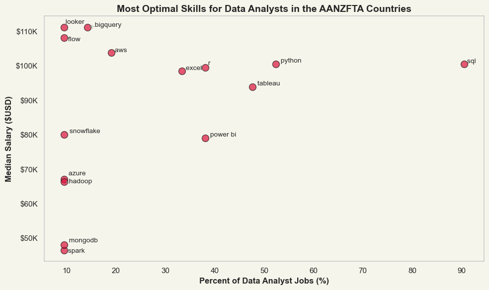

# ***Data Job Market Analysis: The Path to Top Data Analyst Roles***

Welcome to this project where I dive into the data job market, especially for data analysts. The idea behind this? To understand what makes a great data analyst in today’s market—what skills you need, how much you can earn, and where the best opportunities are hiding.

The data I’m working with comes from [Luke Barousse’s Python Course](https://lukebarousse.com/python), which provides the perfect foundation for this analysis. The dataset includes job titles, salaries, locations, and key skills. Using Python, I’ve explored questions like: 

- What skills are most in-demand for data analysts?
- How much can you expect to earn?
- And where do salary and skill demand meet in this field?

Whether you’re just starting out or looking to boost your career, this project gives you the insights to make informed choices and find the opportunities that are right for you. Let’s make sense of the data world and unlock the best paths forward.

## ***The Questions***

Here are the key questions I’m tackling in this project:

1. What are the most in-demand skills for the top 3 data roles?
2. How are the skills for Data Analysts trending right now?
3. What’s the pay like for jobs and skills in the Data Analyst field?
4. What are the best skills for Data Analysts to learn (those that are both in high demand *and* high-paying)?

## ***Tools I Used***
To dive into the data analyst job market, I used a mix of powerful tools that made the process smooth and insightful:

- **Python:** This is the heart of my analysis. It helped me crunch the numbers and uncover key insights. I also tapped into these Python libraries:
    - **Pandas:** The go-to library for working with data and turning it into something meaningful.
    - **Matplotlib:** Used to bring the data to life through visuals.
    - **Seaborn:** Took my visualizations to the next level with more advanced and stylish charts.
- **Jupyter Notebooks:** The perfect platform for running Python scripts and mixing in my thoughts, notes, and analysis all in one place.
- **Visual Studio Code:** My trusted editor for coding, running scripts, and organizing everything smoothly.
- **Git & GitHub:** These were essential for version control, tracking changes, and sharing my code with others, making sure everything stayed on point.

Each of these tools played a big role in helping me explore the data and tell the story behind it.

## ***Data Preparation and Cleanup***

Before diving into the analysis, I made sure the data was clean, reliable, and ready to go. Here's a look at how I prepared everything:

### Import & Clean Up Data

The first step was importing the necessary libraries and loading the dataset. Once the data was in, I cleaned it up to make sure everything was accurate and usable. This involved handling missing values, fixing any errors, and making sure the dataset was consistent—basically, making sure the data was in shape for some serious analysis.

```python
# Importing Libraries
import ast
import pandas as pd
import seaborn as sns
from datasets import load_dataset
import matplotlib.pyplot as plt  

# Loading Data
dataset = load_dataset('lukebarousse/data_jobs')
df = dataset['train'].to_pandas()

# Data Cleanup
df['job_posted_date'] = pd.to_datetime(df['job_posted_date'])
df['job_skills'] = df['job_skills'].apply(lambda x: ast.literal_eval(x) if pd.notna(x) else x)
```
### Filter AANZFTA Jobs

Since I’m from Indonesia, I wanted to focus on the Data Analyst job market in AANZFTA countries (ASEAN + Australia + New Zealand)—regions where many professionals from Indonesia, including myself, often find job opportunities, especially in Singapore and Australia. To make this more relevant, I filtered the dataset to focus specifically on roles in these regions, narrowing down the scope for a more targeted analysis.


```python
# List of ASEAN countries
asean_countries = [
    'Brunei', 'Cambodia', 'Indonesia', 'Laos', 'Malaysia', 
    'Myanmar', 'Philippines', 'Singapore', 'Thailand', 'Vietnam'
]

# Oceanic countries in the AANZFTA
oceanic_countries = [
    'Australia', 'New Zealand'
]

# Combined list for AANZFTA
aanzfta_countries = asean_countries + oceanic_countries

df_DA_AANZFTA = df[df['job_country'].isin(aanzfta_countries) & (df['job_title_short'] == 'Data Analyst')]
```

## ***The Analysis***

Each Jupyter notebook in this project dives into a specific part of the data job market. Here's how I tackled each question:

### 1. **What are the most demanded skills for the top 3 most popular data roles?**

To figure out which skills are the most in-demand for the top 3 data roles, I first filtered out the most popular positions. Once I had that, I dug into the top 5 skills for each of these roles. This analysis gave me a clear picture of which skills are key for landing the most sought-after jobs. It also helped me understand what I should focus on if I'm targeting one of these roles.

Want to see the process in action? Check out my notebook with all the details: [2_Skill_Demand](https://github.com/adinramaadin/Python_Project-2_Data-Job-Market/blob/main/Main_Code_for_Projects/2_Skill_Demand.ipynb).

### **Visualize Data**

```python
fig, ax = plt.subplots(len(job_titles), 1)

# Set plot style and palette
sns.set_theme(style='whitegrid')
sns.set_palette('muted')

# Custom color palette 
custom_palette = LinearSegmentedColormap.from_list(
    "RedGreyBlack", ["#8B0000", "#A9A9A9", "#000000"], N=10 
)

for i, job_title in enumerate(job_titles):
    df_plot = df_skills_perc[df_skills_perc['job_title_short'] == job_title].head(5)
    sns.barplot(data=df_plot, x='skill_percent', y='job_skills', ax=ax[i], hue='skill_count', palette=list(custom_palette_list))
    ax[i].set_title(job_title, weight='bold')
    ax[i].set_ylabel('')
    ax[i].set_xlabel('')
    ax[i].grid(False)  # Both x and y gridlines will show up
    ax[i].get_legend().remove()
    ax[i].set_xlim(0, 78)
    # remove the x-axis tick labels for better readability
    if i != len(job_titles) - 1:
        ax[i].set_xticks([])

    # label the percentage on the bars
    for n, v in enumerate(df_plot['skill_percent']):
        ax[i].text(v + 1, n, f'{v:.0f}%', va='center')

plt.gcf().set_facecolor('#F6F5EB')
plt.rcParams['axes.facecolor'] = '#F6F5EB'
fig.suptitle('Likelihood of Skills Requested in AANZFTA Job Postings', fontsize=15, weight='bold')
plt.subplots_adjust(hspace=0.4)  # Add spacing between subplots

fig.tight_layout(h_pad=.8)
plt.show()
```
#### **Results**



*Bar graph visualizing the salary for the top 3 data roles and their top 5 skills associated with each.*

### **Insights:**

- **SQL** stands out as the most requested skill for both Data Analysts and Data Engineer, showing up in almost than half of job postings for these roles. For Data Scientist, however, **Python** takes the lead, appearing in 57% of job listings.
- Data Engineers need more specialized technical skills like **AWS**, **Azure**, and **Spark**, while Data Analysts and Data Scientists lean more toward general data management and analysis tools, such as **Excel**, **Tableau**, and **R**.
- **Python** is a versatile skill that's in high demand across all three roles, but it's especially sought after for Data Scientists (57%) and Data Engineers (52%).


### ***2. How are in-demand skills trending for Data Analysts?***

To explore how Data Analyst skills have been trending in 2023, I filtered job postings specifically for Data Analysts and grouped the skills by the month they were posted. This gave me a clear view of the top 5 skills that were in demand each month, showing how the popularity of certain skills shifted throughout the year.

Want to dive deeper? Check out my notebook with all the details: [3_Skills_Trend](https://github.com/adinramaadin/Python_Project-2_Data-Job-Market/blob/main/Main_Code_for_Projects/3_Skills_Trend.ipynb).

### ***Visualize Data***

```python
from matplotlib.ticker import PercentFormatter

df_plot = df_DA_AANZFTA_percent.iloc[:, :5]

colors = ["#D14B4B", "#A9A9A9", "#6C6C6C", "#4A4A4A", "#8B8B8B"]

sns.set_theme(style='whitegrid')  
plt.rcParams['axes.facecolor'] = '#F6F5EB'  

fig, ax = plt.subplots(figsize=(10, 6))
fig.patch.set_facecolor('#F6F5EB')  

sns.lineplot(data=df_plot, dashes=False, palette=colors, linewidth=2, ax=ax)

ax.set_title('Trending Top Skills for Data Analysts in the AANZFTA Countries', fontsize=14, weight='bold')
ax.set_xlabel('2023', fontsize=12)
ax.set_ylabel('Likelihood in Job Posting', fontsize=12)

ax.yaxis.set_major_formatter(PercentFormatter(decimals=0))

ax.legend().remove()

for i in range(5):
    ax.text(11.2, df_plot.iloc[-1, i], df_plot.columns[i], color='black', fontsize=10, ha='left', va='center')

sns.despine()
ax.grid(False)
ax.tick_params(axis='both', labelsize=10)
plt.tight_layout()
plt.show()
```
#### **Results**

*Bar graph visualizing the trending top skills for data analysts in the AANZFTA Countries in 2023.*

### **Insights:**

- **SQL** remains the most consistently demanded skill throughout the year, with demand gradually decreasing at first, but then picking up again over time.
- **Excel** saw a significant surge in demand from February to April, eventually overtaking **Python** by the year’s end.
- Both **Python** and **Tableau** showed steady demand with slight fluctuations, especially increasing in November, reinforcing their role as essential skills for Data Analysts.
- **Power BI**, while not as widely demanded as the others, experienced a slight uptick in the middle of the year, before tapering off toward the end.

### ***3. How well do jobs and skills pay for Data Analysts?***

To figure out which roles and skills bring in the highest pay, I focused on jobs in the United States and examined their median salaries. But before diving into that, I first explored the salary distributions of common data jobs like **Data Scientist**, **Data Engineer**, and **Data Analyst** to get a sense of which positions are paying the most.

Want to see the full analysis? Check out my notebook with all the details: [4_Salary_Analysis](https://github.com/adinramaadin/Python_Project-2_Data-Job-Market/blob/main/Main_Code_for_Projects/4_Salary_Analysis.ipynb).

#### **Visualize Data**

```python
import matplotlib.pyplot as plt
import seaborn as sns

# Set the Economist-style theme
sns.set_theme(style='whitegrid')
plt.gcf().set_facecolor('#F6F5EB')  # Set figure background color
plt.rcParams['axes.facecolor'] = '#F6F5EB'  # Set axes background color

# Define the color palette
colors = ["#D14B4B", "#A9A9A9", "#6C6C6C", "#4A4A4A", "#8B8B8B"]
sns.set_palette(sns.color_palette(colors))

# Create the boxplot
sns.boxplot(
    data=df_AANZFTA_top6, 
    x='salary_year_avg', 
    y='job_title_short', 
    order=job_order, 
    linewidth=1.5  # Add line thickness for a sharper look
)

# Title and labels with consistent formatting
plt.title('Salary Distributions of Data Jobs in the AANZFTA Countries', fontsize=14, weight='bold')
plt.xlabel('Yearly Salary ($USD)', fontsize=12)
plt.ylabel('', fontsize=12)

# Format the x-axis
plt.xlim(0, 600000)
ticks_x = plt.FuncFormatter(lambda y, _: f'${int(y/1000)}K')
plt.gca().xaxis.set_major_formatter(ticks_x)

# Remove unnecessary spines
sns.despine()

# Adjust tick font sizes
plt.xticks(fontsize=10)
plt.yticks(fontsize=10)

# Remove grid lines for a cleaner look
plt.gca().grid(False)

# Ensure tight layout to avoid clipping
plt.tight_layout()

# Display the plot
plt.show()
```

#### Results

*Box plot visualizing the salary distributions for the top 6 data job titles.*

#### Insights

- For **Senior Data Analyst** positions, the box is fairly narrow and short, with the whiskers close to the box on the right. There is also a shorter whisker on the left, indicating less salary variability within this role.
- On the other hand, **Data Engineer** roles show a more balanced distribution, with medium-length whiskers extending further to the left. This suggests a bit more salary variation for **Data Engineers** compared to **Data Analysts**.
- The **median salaries** for **Senior Data Analyst**, **Senior Data Engineer**, and **Data Analyst** roles are all near the right end of their respective boxes, indicating that the typical salaries in these roles are skewed towards the higher end. The rest of the roles have their medians more toward the left side of the boxes, reflecting lower typical salaries in comparison.

### ***3. Highest Paid & Most Demanded Skills for Data Analysts***

Next up, I zoomed in on **Data Analyst** roles specifically, to identify which skills are not only the highest-paid but also the most sought-after. To make this clear, I used two bar charts that break down both the **highest-paying skills** and the **most in-demand skills**.

It’s one thing to know what’s trending, but understanding what skills actually bring in the big bucks is a game changer. So, these charts help draw a clear picture of where the opportunities lie for Data Analysts who want to level up both in demand and pay.

```python
fig, ax = plt.subplots(2, 1, figsize=(12, 10))

custom_palette = LinearSegmentedColormap.from_list(
    "RedGreyBlack", ["#8B0000", "#A9A9A9", "#000000"], N=10 
)
plt.figure(figsize=(10, 6))
plt.gcf().set_facecolor('#F6F5EB')
plt.rcParams['axes.facecolor'] = '#F6F5EB'

# Top 10 Highest Paid Skills for Data Analysts
sns.barplot(data=df_DA_top_pay, x='median', y=df_DA_top_pay.index, ax=ax[0], palette=custom_palette(np.linspace(0, 1, len(df_DA_top_pay))))
ax[0].legend().remove()
ax[0].set_title('Highest Paid Skills for Data Analysts in the AANZFTA Countries', fontsize=14, weight='bold')
ax[0].set_ylabel('')
ax[0].set_xlabel('')
ax[0].xaxis.set_major_formatter(plt.FuncFormatter(lambda x, _: f'${int(x/1000)}K'))

# Top 10 Most In-Demand Skills for Data Analysts')
sns.barplot(data=df_DA_skills, x='median', y=df_DA_skills.index, ax=ax[1], palette=custom_palette(np.linspace(0, 1, len(df_DA_top_pay))))
ax[1].legend().remove()
ax[1].set_title('Most In-Demand Skills for Data Analysts in the AANZFTA Countries', fontsize=14, weight='bold')
ax[1].set_ylabel('')
ax[1].set_xlabel('Median Salary ($USD)', fontsize=12)
ax[1].set_xlim(ax[0].get_xlim())  # Set the same x-axis limits as the first plot
ax[1].xaxis.set_major_formatter(plt.FuncFormatter(lambda x, _: f'${int(x/1000)}K'))

sns.despine()
ax[0].grid(False)
ax[1].grid(False)
sns.set_theme(style='whitegrid')
sns.set_palette('muted')
plt.tight_layout()
plt.show()
```

#### Results
Here's the breakdown of the highest-paid & most in-demand skills for data analysts in the AANZFTA Countries:


*Two separate bar graphs visualizing the highest paid skills and most in-demand skills for data analysts in the AANZFTA Countries.*

#### Insights:

- The first chart shows that specialized tools like **Zoom**, **BigQuery**, and **C** are tied to some of the highest salaries in data analysis, with roles involving these skills commanding over $100K. This points to the fact that technical expertise in tools commonly used for data management, cloud computing, and even communication (like Zoom) can significantly increase earning potential.

- The second chart highlights **BigQuery**, **Flow**, **AWS**, and **SQL** as the most in-demand skills, with salaries also climbing above $100K. This shows that while these skills are highly sought after by employers, their high demand aligns with the need for data analysts who can manage large datasets and leverage cloud technologies to make data-driven decisions.

- What’s really striking is how both **demand** and **pay** are strong for skills like **BigQuery** and **AWS**. While these skills are in high demand and can fetch salaries above $100K, they don’t necessarily have to be the most advanced to earn a premium. **SQL**, despite being a foundational skill, is still **incredibly valuable**, appearing in both the most demanded and highest-paying categories.

- This suggests that data analysts aiming for the highest salary potential should focus on mastering **specialized tools** like **BigQuery** and **AWS**, while also ensuring they have a solid foundation in essential skills like **SQL** and **Flow**. It's not just about having niche expertise—being able to handle the core tools that businesses rely on is just as valuable.

### ***4. What are the most optimal skills to learn for Data Analysts?***
So, now the big question: what are the must-learn skills that are both in high demand and high-paying for Data Analysts? To figure this out, I took a deep dive into the data, calculating how often certain skills show up in job postings and what the median salaries look like for each. This allowed me to pinpoint which skills truly stand out as the best ones to develop if you're aiming to skyrocket your career.

View my notebook with detailed steps here: [5_Optimal_Skills](https://github.com/adinramaadin/Python_Project-2_Data-Job-Market/blob/main/Main_Code_for_Projects/5_Optimal_Skills.ipynb).

#### Visualize Data
```python
from adjustText import adjust_text

plt.figure(figsize=(10, 6))
plt.scatter(
    df_DA_skills_high_demand['skill_percent'], 
    df_DA_skills_high_demand['median_salary'], 
    s=100,  # Marker size
    c='crimson',  # Marker color
    alpha=0.7,  # Transparency
    edgecolors='k'  # Black edges
)
plt.xlabel('Percent of Data Analyst Jobs (%)', fontsize=12, weight='bold')
plt.ylabel('Median Salary ($USD)', fontsize=12, weight='bold')  
plt.title('Most Optimal Skills for Data Analysts in the AANZFTA Countries', fontsize=14, weight='bold')


# Get current axes, set limits, and format axes
ax = plt.gca()
ax.yaxis.set_major_formatter(plt.FuncFormatter(lambda y, pos: f'${int(y/1000)}K'))  # Example formatting y-axis

# Add labels to points and collect them in a list
texts = []
for i, txt in enumerate(df_DA_skills_high_demand.index):
    texts.append(plt.text(df_DA_skills_high_demand['skill_percent'].iloc[i], df_DA_skills_high_demand['median_salary'].iloc[i], " " + txt, fontsize=10))

# Adjust text to avoid overlap and add arrows
adjust_text(
    texts, 
    arrowprops=dict(arrowstyle='->', color='gray', lw=0.5), 
    expand_points=(1.2, 1.2),  
    expand_text=(1.2, 1.2)  
)

sns.set_theme(style='whitegrid')  
plt.gcf().set_facecolor('#F6F5EB')  
plt.rcParams['axes.facecolor'] = '#F6F5EB'
plt.gca().grid(False)  
plt.tight_layout()
plt.show()
```

#### Results


*A scatter plot visualizing the most optimal skills (high paying & high demand) for data analysts in the AANZFTA Countries*

#### **Insights:**

- **Looker** stands out with the highest median salary, above $110K, even though it’s less common in job postings. This signals that specialized skills like Looker are highly valued in the data analyst field, making them worth learning, even if they’re not as widespread.

- **BigQuery** and **Flow** also follow closely with competitive salaries, showing that expertise in specialized database and cloud skills can pay off.

- On the flip side, more commonly required skills like **SQL** dominate job listings and still command solid salaries. However, **Python**, **Tableau**, **Excel**, **R**, and **SQL Server** offer a mix of both: they're common in job postings and come with higher-than-average salaries. This suggests that proficiency in these tools not only keeps you relevant but also opens doors to good-paying opportunities in data analytics.

In short, a balance of highly specialized skills (like Looker) and widely demanded skills (like SQL, Python, and Tableau) seems like the sweet spot for anyone looking to thrive in the data analyst world.

# What I Learned

Throughout this project, I got a much clearer picture of the data analyst job market and sharpened my technical skills in Python, especially when it comes to data manipulation and visualization. Here are a few key takeaways:

- **Advanced Python Skills**: I got hands-on with libraries like **Pandas** for manipulating data, and **Seaborn** and **Matplotlib** for visualizing it. These tools made complex data analysis tasks smoother and faster, helping me work smarter, not harder.
  
- **The Power of Data Cleaning**: One thing became crystal clear – no amount of fancy analysis can make up for messy data. Clean, well-prepared data is the foundation for any meaningful analysis. Taking time to clean and prepare data is just as important as the analysis itself.

- **Smart Skill Strategy**: This project really hit home how important it is to align your skills with what the market is looking for. Knowing which skills are in-demand, what they’re worth, and where the job opportunities are lets you plan your career moves more strategically.

# Insights

This project gave me some big-picture insights about the data job market, and here’s what stood out:

- **Skill Demand and Salary**: There’s a pretty obvious link between the skills that are in-demand and the salaries they command. Advanced and specialized skills like **Python** and **Oracle** are often associated with higher pay – it’s a classic case of "the more you know, the more you can earn."

- **Shifting Market Trends**: The data job market is dynamic. Skill demand shifts, sometimes quickly, and keeping up with those changes is essential for career growth. It’s a reminder that adaptability is key in the tech world.

- **Economic Value of Skills**: Understanding which skills are both popular and well-compensated is like having a map to guide your career. If you can prioritize learning these in-demand, high-paying skills, you’re setting yourself up for success in the long run.

# Challenges I Faced

This project wasn’t without its challenges, but each one turned into a valuable learning opportunity:

- **Data Inconsistencies**: Let’s just say I spent more time than I’d like wrestling with missing or inconsistent data. But, tackling these issues head-on taught me how important data cleaning is to ensure accurate insights.

- **Complex Visualizations**: Sometimes, it felt like designing the perfect chart or graph was more art than science. Making complex data visually digestible took some effort, but it’s critical to ensure insights are clear and impactful.

- **Balancing Depth with Breadth**: There were moments when I had to decide just how deep to go with certain analyses. It was a juggling act – I wanted to cover all the important points without getting bogged down in too many details. 

# Conclusion

This deep dive into the data analyst job market has been incredibly eye-opening. It’s shown me what skills are crucial and how the market’s trends are constantly shifting. The insights I’ve gained not only deepen my understanding of this space but also give practical guidance for anyone looking to level up their data analytics career. 

As the field evolves, it’s clear that continuous learning and staying on top of market trends will be essential for success. This project is just the beginning – and it’s left me hungry for more. Data analytics is a fast-paced, ever-changing world, and I’m excited to keep learning and adapting along the way.
